```mermaid
flowchart TD
    subgraph Triggers["Pull request triggers"]
        PR["opened / synchronize / reopened / ready_for_review"]
    end

    subgraph Changes["compute-changes"]
        Files["changed files"]
        Affected["affected crates + reverse deps"]
        ClippyBins["clippy binpack\nplan-clippy-batches.sh"]
        TestBins["crate-test binpack\nplan-test-batches.sh"]
        Backend["backend_changed?"]
        BackendRecipe["backend_recipe_changed?"]
        InferenceArtifact["inference_artifact_required?"]
        WindowsCPU["windows_cpu_build_required?"]
        WindowsGPU["windows_gpu_build_required?"]
        SDK["sdk_smoke_required?"]
        Website["website_changed?"]
        WebsiteDocs["website_docs_changed?"]
        CLIDocs["cli_surface_changed?"]
        Docs["docs_only?"]
    end

    PR --> Files --> Affected
    Affected --> ClippyBins
    Affected --> TestBins
    Files --> Backend
    Files --> BackendRecipe
    Files --> WindowsCPU
    Files --> WindowsGPU
    BackendRecipe --> Backend
    BackendRecipe --> WindowsCPU
    BackendRecipe --> WindowsGPU
    Affected --> InferenceArtifact
    Backend --> InferenceArtifact
    SDK --> InferenceArtifact
    Affected --> SDK
    Files --> Website
    Files --> WebsiteDocs
    Files --> CLIDocs
    Files --> Docs

    subgraph Quality["pr_quality.yml · PR Quality Checks"]
        direction TB
        Fmt["rust-fmt"]
        Clippy["rust-clippy matrix\nweighted affected-crate bins"]
        UIQ["ui-quality\nReact console"]
        CLIDocsSync["cli-docs-sync\nCLI surface requires public docs"]
        QSummary["summary"]
        Fmt --> QSummary
        Clippy --> QSummary
        UIQ --> QSummary
        CLIDocsSync --> QSummary
    end

    subgraph WebsitePR["pr_website.yml · PR Website Checks"]
        direction TB
        WebsiteBuild["website-build\nEleventy/Tailwind/Pagefind"]
        WebsiteSummary["summary"]
        WebsiteBuild --> WebsiteSummary
    end

    ClippyBins --> Clippy
    Affected --> Fmt
    Files --> UIQ
    Website --> WebsiteBuild
    WebsiteDocs --> CLIDocsSync
    CLIDocs --> CLIDocsSync

    subgraph PRCI["pr_builds.yml · PR Builds"]
        direction TB
        subgraph Producers["producers, checks, and composers"]
            LinuxHost["linux_host_input\none immutable neutral host"]
            LinuxCPU["linux_cpu_runtime_input\none CPU runtime"]
            LinuxProduct["linux_cpu_artifact\ncompose host + CPU runtime\n→ ci-linux-inference-binaries"]
            StaticABI["linux_static_abi_input\none immutable CPU llama ABI"]
            RustCrateTests["rust_crate_tests matrix\nmetadata-derived crate suites"]
            LinuxTests["linux_test_groups matrix\nprotocol · Skippy smoke"]
            LinuxCUDARuntime["linux_cuda_runtime_input\none CUDA runtime"]
            LinuxCUDAProduct["linux_cuda_product\ncompose host + CUDA runtime"]
            LinuxROCmRuntime["linux_rocm_runtime_input\none ROCm runtime"]
            LinuxROCmProduct["linux_rocm_product\ncompose host + ROCm runtime"]
            LinuxVulkanRuntime["linux_vulkan_runtime_input\none Vulkan runtime"]
            LinuxVulkanProduct["linux_vulkan_product\ncompose host + Vulkan runtime"]
            WindowsChecks["windows_checks\nlightweight broad-Rust signal"]
            WindowsHost["windows_host_input\none immutable debug host"]
            WindowsCPURuntime["windows_cpu_runtime_input\none CPU runtime"]
            WindowsGPURuntimes["windows_gpu_runtime_inputs matrix\nCUDA / ROCm / Vulkan runtimes"]
            WindowsCPUProduct["windows_cpu_product\ncompose host + CPU runtime"]
            WindowsGPUProducts["windows_gpu_products matrix\ncompose shared host + GPU runtime"]
            MacHost["macos_host_input\none immutable neutral host"]
            MacRuntime["macos_metal_runtime_input\none Metal runtime"]
            MacCPU["macos_cpu_artifact\ncompose host + Metal runtime\n→ ci-macos-inference-binaries"]
            KotlinInput["kotlin_sdk_input\ndebug native SDK producer"]
            SwiftInput["swift_sdk_input\nhost-only XCFramework producer"]
            MacTests["macos_unit_tests"]
        end

        subgraph Smokes["artifact-consuming smokes"]
            Restore["restore-smoke-inputs action\ndownload artifact · stage binary · restore model"]
            Inference["smoke.yml\nLinux inference + OpenAI + split serving"]
            Scripted["scripted-binary-smoke.yml\ntwo-node client/serving"]
            SDKSmoke["sdk-smoke.yml\nRust · Kotlin · Swift"]
        end
    end

    Docs -. "true: gate heavy jobs" .-> PRCI
    InferenceArtifact --> LinuxHost
    InferenceArtifact --> LinuxCPU
    LinuxHost --> LinuxProduct
    LinuxCPU --> LinuxProduct
    Affected --> LinuxTests
    TestBins --> StaticABI
    SDK --> StaticABI
    StaticABI --> RustCrateTests
    StaticABI --> LinuxTests
    StaticABI --> KotlinInput
    InferenceArtifact --> MacHost
    InferenceArtifact --> MacRuntime
    MacHost --> MacCPU
    MacRuntime --> MacCPU
    SDK --> KotlinInput
    SDK --> SwiftInput
    Affected --> MacTests
    Backend --> LinuxCUDARuntime
    Backend --> LinuxROCmRuntime
    Backend --> LinuxVulkanRuntime
    LinuxHost --> LinuxCUDAProduct
    LinuxCUDARuntime --> LinuxCUDAProduct
    LinuxHost --> LinuxROCmProduct
    LinuxROCmRuntime --> LinuxROCmProduct
    LinuxHost --> LinuxVulkanProduct
    LinuxVulkanRuntime --> LinuxVulkanProduct
    Affected --> WindowsChecks
    WindowsCPU --> WindowsHost
    WindowsCPU --> WindowsCPURuntime
    WindowsGPU --> WindowsHost
    WindowsGPU --> WindowsGPURuntimes
    WindowsHost --> WindowsCPUProduct
    WindowsCPURuntime --> WindowsCPUProduct
    WindowsHost --> WindowsGPUProducts
    WindowsGPURuntimes --> WindowsGPUProducts
    LinuxProduct -- "artifact: ci-linux-inference-binaries" --> Restore
    MacCPU -- "artifact: ci-macos-inference-binaries" --> Restore
    Restore --> Inference
    Restore --> Scripted
    Restore --> SDKSmoke
    KotlinInput -- "artifact: pr-kotlin-native-sdk-input" --> SDKSmoke
    SwiftInput -- "artifact: pr-swift-sdk-input" --> SDKSmoke
    SDK --> SDKSmoke

    subgraph Cleanup["pr_cleanup.yml · PR Cache Cleanup"]
        Closed["pull_request_target closed"]
        PlanCaches["plan cache shards for\nrefs/pull/<PR>/merge"]
        DeleteCaches["matrix delete cache shards\nrepo-var workers · serial per worker"]
        DeleteArtifacts["delete artifacts from\nmatched PR workflow runs"]
        CleanupSummary["cleanup summary"]
        Closed --> PlanCaches --> DeleteCaches
        Closed --> DeleteArtifacts
        DeleteCaches --> CleanupSummary
        DeleteArtifacts --> CleanupSummary
    end

    subgraph MainRelease["non-PR workflows"]
        MainCI["ci.yml\npush main / dispatch"]
        WebsiteDeploy["website-pages.yml\nActions Pages deploy\nPublic Website environment"]
        DockerValidate["docker.yml\nmanual client Dockerfile validation"]
        DepotRegistryCanary["depot-registry-canary.yml\nfresh-runner upstream vs pull-through pulls"]
        Release["release.yml\nrelease artifacts + package/image/npm dispatch"]
        FlyConsole["fly-deploy-console.yml\nmanual Fly console deploy"]
    end

    style Quality fill:#1a3a5c,stroke:#4a90d9,color:#e8f4fd
    style WebsitePR fill:#1f355c,stroke:#8ab4f8,color:#e8f4fd
    style PRCI fill:#1a3d2e,stroke:#2ecc71,color:#eaffef
    style Producers fill:#1a3d2e,stroke:#2ecc71,color:#eaffef
    style Smokes fill:#17324d,stroke:#4a90d9,color:#e8f4fd
    style Cleanup fill:#3d2b00,stroke:#f39c12,color:#fff8e1
    style MainRelease fill:#2a2a2a,stroke:#888,color:#ddd
```

## Current PR and main CI product contracts

### Current main CI product contract

- `ci.yml` validates the same composed product shape on trusted main pushes and
  manual dispatches: a backend-neutral host plus one separately packaged native
  runtime. The Linux host and CPU runtime build independently, then a
  composition-only job uploads product-v2 for every downstream smoke. SDK
  smokes consume the staged runtime instead of compiling a private replacement.
  The Swift XCFramework is also built by the same typed producer used by PR and
  release: main requests exhaustive `full` mode and its smoke only verifies and
  consumes that immutable artifact. Main and release give the seven-target
  full producer a 180-minute cold-start ceiling; PR host-only validation keeps
  its shorter iteration budget.
- Main builds immutable Linux, macOS, and Windows release hosts independently
  from their CPU, Metal, CUDA, ROCm, and Vulkan runtimes. Composition-only jobs
  verify and combine those exact producer inputs. Each Linux GPU backend has
  its own runtime producer and matching thin composer, so a finished backend
  never waits for unrelated runtime rows before its product is ready. Linux
  and Windows backend rows build only their runtime and reuse the platform
  host. Each product requires `--version`, `runtime list`, and client readiness
  without a driver stub. GPU availability remains separate hardware
  qualification.
- Release builds Node native addons through one typed reusable producer fanned
  out across Darwin ARM64/x64, Linux ARM64/x64, and Windows x64. Every lane
  performs a fresh npm install and native version smoke before emitting a
  manifest-bound, checksummed archive. Release publication requires all five
  artifacts, and `mesh-packaging` consumes those exact release assets instead
  of compiling addon source again.
- Release publication dispatches downstream package/image/npm promotion only
  for stable versions. Prereleases retain the complete immutable GitHub Release
  artifact graph for validation but never invoke `mesh-packaging`.
- `.github/actions/prepare-host-input`,
  `.github/actions/prepare-windows-host-input`,
  `.github/actions/prepare-native-runtime-input`,
  `.github/actions/prepare-native-sdk-input`,
  `.github/actions/prepare-static-abi-input`, and
  `.github/actions/compose-product-input` are the shared PR/main/release
  primitives. The composer never compiles either producer input.
- Linux crate-test and grouped-test matrices plus the Kotlin native-SDK producer
  restore one checksummed, target-described static CPU llama ABI from
  `linux_static_abi_input`; individual consumers never rebuild or raw-extract
  the same patch queue concurrently.
- Trusted Windows cache misses are saved through
  `.github/actions/save-and-verify-actions-cache`. It snapshots existing exact
  key/ref records before the upload and requires a new non-empty cache record
  afterward, then performs a lookup-only restore with the same path and key to
  prove the current cache version exists. A cache-service reservation warning
  therefore cannot leave the warmer green without publishing a reusable ABI
  input. The restore action exports the normalized absolute cache path used by
  the save action, and publication-action changes participate in the exact key,
  preventing an incompatible opaque cache version from blocking its
  replacement under the same key.

### Current PR Builds contract

- `pr_quality.yml` is named **PR Quality Checks** and owns the earliest Rust,
  React console, and CLI-documentation feedback: formatting, React console UI
  quality when relevant, the CLI-docs sync guard when Rust CLI definitions
  change, and deterministic clippy bins from
  `scripts/plan-clippy-batches.sh`. Routing no longer waits for the compiled
  consistency checks; `ci-consistency` runs beside it and remains part of the
  summary gate. Formatting and UI quality run directly on the selected runner
  instead of paying the public backend-image pull cost.
- `pr_website.yml` is named **PR Website Checks** and owns the public website PR
  canary. It uses `.github/actions/compute-changes` and runs
  `website-build` only when `website_changed` is true, or when manually
  dispatched, so public website validation is separate from Rust/React-console
  quality checks while still using the central routing signals.
- `ui_changed` and `website_changed` intentionally describe different products:
  `ui_changed` is only the embedded React console under `crates/mesh-llm-ui/**`,
  while `website_changed` is only the public Eleventy/Tailwind/Pagefind website
  and its passthrough inputs. Website changes do not trigger React console UI
  quality or UI artifact rebuilds.
- CLI surface changes in `crates/mesh-llm-cli/src/{parser,models,runtime,benchmark}.rs`
  set `cli_surface_changed`. When that flag is true, `cli-docs-sync` requires a
  public website docs/example update under `website/src/docs/pages/` or
  `website/src/_includes/`, with `website/src/docs/pages/CLI.md` as the primary
  command reference.
- Changes to `compute-changes` or the central PR/main/release workflow callers
  fail open to the SDK producer and smoke graph. Caller-owned mode, timeout,
  artifact, and trust-policy edits therefore cannot skip the reusable SDK
  contracts they modify.
- `pr_builds.yml` is named **PR Builds** and owns PR target jobs plus integration
  and smoke validation. Linux and macOS CPU artifact jobs upload the binaries
  that downstream smoke jobs consume before long validation groups finish.
  Every affected Rust workspace crate is assigned to a generated
  `rust_crate_tests` matrix and runs its complete `cargo test -p <crate>` suite;
  the shard containing `skippy-runtime` downloads the public Qwen3 correctness
  fixture and sets `SKIPPY_CORRECTNESS_MODEL`, so the model-backed grammar
  equivalence test runs instead of being skipped; protocol compatibility and
  Skippy smoke remain separate integration rows.
  Linux host/CPU-runtime and macOS host/Metal-runtime producers run
  independently, and their product composers never compile. Linux backend rows
  are split into one independent CUDA, ROCm, or Vulkan runtime producer plus
  one matching `runner_4` composition-only product job. They consume the same
  immutable host without a matrix-wide fan-in barrier. Windows follows the
  same graph: one debug neutral host, independent CPU/CUDA/ROCm/Vulkan runtime
  inputs, and composition-only products. Unsupported macOS CUDA, ROCm, and
  Vulkan rows are omitted. The PR Swift `host-only` XCFramework producer starts
  directly from change routing, in parallel with the macOS product and unit
  tests; Swift smoke waits only for the macOS product and XCFramework inputs.
  `sdk_smoke_required` makes the shared static CPU ABI producer eligible; the PR
  Kotlin debug native-SDK producer restores that immutable ABI, validates its
  complete link closure, pinned build-image epoch, and build stamp through the
  verification-only `--require-prebuilt-llama` path, and compiles only the Rust
  FFI while the Linux product proceeds independently. Both build-script and
  Cargo auto-build fallbacks are disabled for that reuse path. Kotlin smoke
  waits only for the product and native-SDK inputs and performs no native
  compilation.
- **PR Builds Summary** is the stable, non-matrix branch-protection check for
  this workflow. `changes` runs `scripts/plan-pr-build-jobs.py` once and exports
  `required_jobs_json`; every conditional top-level job uses membership in
  that plan as its route, while normal `needs` success semantics keep consumers
  behind their producers. The summary directly depends on every other
  top-level job and consumes the same plan. A skipped job is accepted only when
  the planner did not require it, so a required producer or dependency chain
  cannot disappear behind propagated skips. Any failure, cancellation, unknown
  result, duplicate plan entry, or required ID outside the summary graph fails
  the gate. The job uses `if: ${{ !cancelled() }}` so ordinary upstream
  failures are still summarized without using `always()`.
- Product readiness starts a local mDNS client and never depends on the mutable
  public mesh. The public `client --auto` admission probe is manual-only, so an
  external peer outage cannot block a pull request or release.
- Pull requests test affected crates plus their reverse dependents. Main pushes
  and manual dispatches assign every Cargo workspace member to the matrix, so a
  targeted-routing mistake cannot permanently hide a crate suite.
- The affected-crate fail-open list includes `mesh-llm-log-store`, so SQLite
  logging-store changes route its own suite and reverse dependents.
- `rust_changed` is not an artifact-build signal. Rust tooling changes such as
  `tools/xtask/**` still run PR Quality formatting/clippy, but PR Builds only
  builds `mesh-llm` artifacts when `inference_artifact_required` is true: a
  runtime-facing crate, SDK smoke input, React console UI artifact input,
  backend/native input, all-rust fail-open/escalation, or manual dispatch.
- `Justfile` is routed by changed hunks, not by path alone. Website/dev recipe
  edits stay light, while native build, ABI, release, bundle, and package
  recipe edits set `backend_recipe_changed`, which feeds backend artifacts and
  Windows CPU/GPU build eligibility.
- Workflow/orchestration-only PR edits validate the PR routing graph without
  becoming Rust crate changes. They must not fan out into Linux/macOS artifact
  producers, native backend, Windows GPU, benchmark, or SDK-smoke lanes unless a
  changed file also affects Rust crates, React console UI assets, public website
  inputs, SDK inputs, or backend products. Backend lanes are reserved for files
  that can affect native ABI/backend products, such as `third_party/llama.cpp/**`,
  `crates/skippy-ffi/**`, backend build scripts, backend-relevant Justfile
  hunks, and `.github/cache-version.txt`.
- Windows broad-Rust changes run lightweight Cargo checks. The existing
  `windows_checks` job also runs focused `mesh-llm-log-store` artifact-path and
  SQLite root/database/WAL/SHM privacy-ACL tests when that crate is affected or
  on manual dispatch. The immutable debug host, CPU runtime, and CPU product run only when
  `windows_cpu_build_required` is true or the workflow is manually dispatched.
  CUDA/ROCm/Vulkan runtime producers and composition-only product jobs run only
  when `windows_gpu_build_required` is true, backend-relevant Justfile hunks
  changed, or the workflow is manually dispatched. All products consume the
  same host artifact and use the release composer contract.
- `pr_cleanup.yml` deletes PR merge-ref caches and artifacts from positively
  matched PR workflow runs when a pull request closes. Cache cleanup first plans
  deterministic shards, then fans deletion out across
  `vars.PR_CACHE_CLEANUP_WORKERS` workers (default `5`) while keeping each worker
  serial and rate-limited; a final summary aggregates cache shard results plus
  artifact cleanup. Cleanup-only workflow edits do not fan out into
  Rust/build/smoke jobs.
- Docker image and npm publishing are intentionally not part of pull request
  CI. `docker.yml` is a manual, non-publishing client Dockerfile validation
  workflow. `release.yml` owns backend-neutral host artifacts per
  OS/architecture, manifested native runtimes per backend lane, and product
  composition that records both immutable digests while retaining
  compatibility archive names. Host producers attest and import-check the host;
  consumers verify and copy those exact bytes rather than rebuilding or
  re-stamping them. The Windows host input includes a checksum-protected
  producer-built attestation verifier so Windows composers do not compile
  workspace code. Product consumers never rebuild a missing producer. It
  dispatches a completed stable release with the full GPU matrix to
  `Mesh-LLM/mesh-packaging`, which owns package, GHCR, and npm publication.
  Prereleases publish immutable GitHub Release inputs but never dispatch
  downstream publication.
- Merged
  [`mesh-packaging#16`](https://github.com/Mesh-LLM/mesh-packaging/pull/16)
  makes that downstream graph artifact-only and build-once. Its complete
  `v0.75.0-rc1` dry rehearsal
  [30593548823](https://github.com/Mesh-LLM/mesh-packaging/actions/runs/30593548823)
  passed 41 jobs with 15 intentional publication-only skips, exercising all
  11 native package rows, exact final-image QA, Homebrew, all five upstream
  Node addon lanes, npm assembly, host invariants, and immutable evidence.
  Merge commit `76c619bcdd82773e159248a2282187b0b2973daa` then passed
  default-branch Packaging Precheck
  [30595367445](https://github.com/Mesh-LLM/mesh-packaging/actions/runs/30595367445).
- `fly-deploy-console.yml` is a manual (`workflow_dispatch`) deploy of the
  `mesh-llm-console` Fly app. It builds the image on Fly's remote builders from
  `fly/Dockerfile` and authenticates with the app-scoped `FLY_API_TOKEN` repo
  secret. It carries no pull request trigger and does not run release or smoke
  jobs.

## Prebuilt runner image contract

Linux CI environments are maintained in
[`Mesh-LLM/mesh-llm-runner-images`](https://github.com/Mesh-LLM/mesh-llm-runner-images)
and published at `ghcr.io/mesh-llm/mesh-llm-cuda-runner`. Every image is built
from the same core toolchain and selects an execution environment independently
from its backend SDK:

- `public-<backend>-*` runs as a job-level `container:` on an Ubuntu
  GitHub-hosted, Depot-managed, or legacy container-capable self-hosted runner.
- `self-hosted-<backend>-*` adds the Actions runner and is used directly as an
  ARC pod image. Jobs targeting an ARC scale-set label must not wrap that pod in
  a second job container.
- CPU, Vulkan, CUDA 12, and CUDA 13 publish AMD64 and ARM64 manifest children.
  ROCm 7.0 and 7.2 are AMD64-only until an ARM64 ROCm lane is supported and
  verified by MeshLLM.

The compatibility `public-*` manifest selects CPU on both architectures. The
compatibility `self-hosted-*` manifest preserves the deployed K3s topology by
selecting CUDA 12 on AMD64 and CPU on ARM64. New consumers should use an
explicit backend image instead of relying on those aliases.

The current image family is a compatibility contract, not the final
role-isolated topology. The planned split has these prerequisites:

- a Node-capable UI producer uploads prepared UI assets before the Node-free
  `public-rust-host` role starts;
- `public-native-cpu` and the
  `public-native-{cuda,rocm,vulkan}` roles own only their matching native
  toolchain and packaging surface;
- `public-compose` owns artifact extraction, verification, and composition,
  without a compiler or backend SDK;
- every role has a role-specific verifier that checks required capabilities
  and forbidden dependency overlap;
- a pinned JavaScript action is canaried in every public role on both
  GitHub-hosted and trusted Depot runners, proving the Actions Node-external
  contract even for Node-free images;
- `self-hosted-*` runner/device overlays are added and verified last.

The first runner-image migration phase merged in
[`mesh-llm-runner-images#9`](https://github.com/Mesh-LLM/mesh-llm-runner-images/pull/9)
implements one immutable chain:
`build once -> stage digest -> verify that exact digest -> promote digest`.
PRs build only affected families plus the mandatory public CPU AMD64 contract,
use BuildKit caches read-only, and cannot stage or promote. Main pushes stage
candidate digests; weekly and explicit manual runs promote a complete retained
cohort. The reusable stage workflow derives its own trusted runner/cache policy,
source revisions are verified, content-digest tags identify immutable
candidates, and one serial reconciliation updates the `latest` cohort.
Manifest assembly and human-facing tags consume verified digests and do not
rebuild an architecture image. The pre-migration compatibility-image
[run 30248081255](https://github.com/Mesh-LLM/mesh-llm-runner-images/actions/runs/30248081255)
took 39m 15s across 55 jobs; its slowest test build step was 14m 25s and a
later second public ROCm 7.2 AMD64 publication build took 18m 03s. That run
demonstrates duplicate construction, but it did not retain authoritative
compressed-size or controlled cold-pull evidence. Role-size and pull-time
thresholds remain proposed rollout gates until measured.

Merge commit `4e79e68e22a5ea9bb1eedf9a2a7e7ccfc20b2bca`
passed the trusted main
[run 30522118156](https://github.com/Mesh-LLM/mesh-llm-runner-images/actions/runs/30522118156)
with 35 successful jobs, four intentional skips, and zero failures.

The replacement PR
[run 30504335079](https://github.com/Mesh-LLM/mesh-llm-runner-images/actions/runs/30504335079)
exercised all 20 platform rows because the Dockerfile changed. Its 22 allocated
jobs remained GitHub-hosted and completed in 6m 22s wall / 1h 13m 07s
aggregate, versus 22m 57s / 2h 52m 59s for the first build-once run. The
slowest self-hosted ROCm 7.2 row fell from 22m 20s to 5m 48s, and logs contained
no actual cache-export phase. This is PR-validation evidence only; registry
staging, cohort promotion, compressed-size, and controlled cold-pull gates
still require trusted runs.

Production workflows and Flux resources must pin the multi-architecture OCI
digest, using `ghcr.io/mesh-llm/mesh-llm-cuda-runner@sha256:<digest>`. Timestamp,
source-revision, and `*-latest` tags are discovery or evaluation inputs only;
the registry publishing path does not enforce or document no-retag protection.
Resolve the selected tag to its published digest before updating a production
consumer. Once pulled, unchanged image layers are reusable from the container
runtime's cache. This removes repeated operating-system package installation
from the job path and reduces failures caused by package mirrors, repository
metadata, transient downloads, or host drift.

ARC pods benefit directly from the persistent image cache on each K3s node.
GitHub-hosted runners may still start on a cold host and pull the image, so
their local layer cache is opportunistic rather than guaranteed; immutable,
shared layers still make those pulls deterministic and cacheable by the
available container and registry infrastructure.

The runner-image build checks out a requested MeshLLM revision, discovers its
Cargo, Node, Python, and Go manifests, and injects an environment-specific,
content-addressed manifest bundle. It then warms the locked dependency caches.
That process improves startup time, but does not move dependency ownership out
of MeshLLM's checked-in manifests.

| Dependency need | Authoritative location | Required change |
| --- | --- | --- |
| Rust, Node, Python, or Go project/test dependency | MeshLLM manifest and lockfile | Update and validate the manifest/lockfile in this repository. |
| Shared Linux package or CLI used by both runner types | `profiles/common.yml` in `mesh-llm-runner-images` | Update the YAML profile, rebuild all architectures, and publish a new image. |
| Backend SDK package | `profiles/backends/<backend>.yml` in `mesh-llm-runner-images` | Update the backend profile and verify every supported architecture. |
| Public-only or self-hosted-only system capability | `profiles/public.yml` or `profiles/self-hosted.yml` | Update the environment profile, verify its architecture matrix, and publish a new image. |
| Toolchain or capability requiring custom installation | Owning installer in `mesh-llm-runner-images` | Update the installer and image verification, then roll forward the pinned consumer. |
| Truly job-scoped external service | Pinned action or service container | Document why it cannot be part of a manifest or runner image. |

The key review rule is: **a missing dependency must cause a manifest,
lockfile, runner profile, or runner installer update; it must not be repaired by
adding a one-off package installation to a MeshLLM workflow.** New workflow-local
`apt-get`, `pip`, global `npm`, `cargo install`, or downloaded-tool bootstrap
steps—and setup actions that download an already-standardized toolchain—should
be rejected. Existing setup blocks are migration debt and should be removed as
each lane adopts the runner image, not copied into new jobs.

An emergency exception must be temporary and include a reason, owner, and
linked removal issue or expiry date. It is not an alternative dependency
management path.

The production rollout applies explicit public CPU, Vulkan, CUDA, and ROCm
digests to the applicable Linux jobs in `pr_builds.yml`, `ci.yml`,
`pr_quality.yml`, and `release.yml`. Backend images contain their compiler and
SDK but do not manufacture GPU access: hosted lanes are compile/package checks,
while runtime GPU assertions require a matching restricted self-hosted pool.
Linux workflow-local toolchain and package setup blocks are migration debt and
must be removed when their lane adopts an image, not copied elsewhere.

PR Builds runs `public_runner_image_contract` inside the public image when the
runner workflow, cache integration, or cache version changes (and on manual
dispatch). Ordinary source/docs PRs do not pay this infrastructure canary.
Trusted main CI owns the two-row `arc_runner_image_contract` matrix directly on
`mesh-llm-amd64` and `mesh-llm-arm64`; untrusted PR-event jobs never request
those labels. The public job validates the baked dependency/tool contract. The
ARC job checks the native machine architecture, validates the self-hosted
image, and performs a small Rust check. It has no hosted fallback by design.

Repository visibility and GHCR package visibility are separate controls. If an
anonymous pull still returns `401` or `403`, public-container jobs must grant
`packages: read` and authenticate `container.credentials` with `github.actor`
and `secrets.GITHUB_TOKEN`. Making `mesh-llm-runner-images` public does not by
itself prove that an existing package is anonymously readable.

The public image already contains `sccache`. In trusted jobs, the
repository-local `configure-sccache-gha` action may use Depot's injected WebDAV
endpoint/token and start a `disk,webdav` cache. Current pull-request jobs remain
GitHub-hosted. When the typed Depot permission is false, the cache action starts
the sccache child with a credential-free, job-local disk backend. That isolates
only sccache: Depot's automatically injected job token and transparent
GitHub-cache API redirection remain available to other code on a Depot runner.
Consequently, no untrusted PR code may run on Depot while automatic cache
injection is enabled. GitHub-hosted trusted jobs retain the existing `disk,gha`
path or explicit disk-only mode. Pull-request jobs use writable job-local disk
only; the pinned sccache otherwise makes the mixed chain wholly read-only and
records every miss as a rejected write. Trusted main, release, warmer, and
dispatch paths own remote publication. This avoids repository-wide per-object
upload throttling and misleading PR write errors. Cache read failures degrade
to misses, cache write failures only warn, and a failed remote probe restarts
`sccache` with disk-only storage. PR crate-test shards restore
the existing `main-rust-crate-tests-<shard>` Cargo target caches read-only
(`save-if: false`), so trusted main owns the cache while PRs avoid recompiling
the same workspace graph. GitHub-hosted main crate-test shards also use
writable job-local sccache because four concurrent remote per-object writers
caused 94% of cold-control GHA write errors; their distinct bulk Cargo target
caches own persistent reuse. Other trusted producers and grouped tests retain
remote sccache. An explicitly authorized Depot call selects `disk,webdav`
before this GHA-only opt-out.

Native ABI cache keys and llama build stamps share one resolved toolchain epoch.
Digest-pinned Linux jobs use the immutable runner-image digest. Hosted macOS
keys include the exact image revision plus Xcode/Clang/CMake/Ninja fingerprint;
Windows warmer, PR, main, and release jobs use the exact hosted image revision
alongside backend SDK and architecture inputs. Cache-hit paths validate the
stored build stamp and required link closure instead of trusting the cache API
result alone.

## Depot rollout

Every current `pull_request` job selects GitHub-hosted runners, regardless of
repository ownership or `DEPOT_PR_RUNNERS_ENABLED`; that variable is ignored.
The selector is only defense in depth
because PR workflow and local-action files are themselves PR-controlled.

Trusted main/release jobs use `DEPOT_RUNNERS_ENABLED`, and a trusted main-ref
manual dispatch can use `use_depot=true` for a bounded canary. The selector
requires `refs/heads/main`; tag pushes and feature refs fall back to hosted
runners. It emits both Intel and ARM64 labels from the same trust decision for
eligible producers and composers.

The selected `native-sdk-artifact.yml` and `static-abi-artifact.yml` reusable
workflows own a stricter policy because a caller can pin the protected workflow
while still asking it to check out caller-controlled contents. They accept only
a bounded `runner_size` (`default`, `4`, `8`, or `16`), then a fixed
GitHub-hosted policy job derives the build label and Depot-cache permission
from the exact repository, event, `refs/heads/main`, repository gate, and
target architecture. Callers cannot provide `runs-on` or independently enable
Depot WebDAV. PR and `pull_request_target` events, tags, feature refs, external
repositories, macOS targets, and a disabled gate without the authorized canary
always select the architecture-matching GitHub-hosted runner with cache
permission false. The event-owned `use_depot` canary may enable Depot only for
an exact `Mesh-LLM/mesh-llm` main-ref `workflow_dispatch`; it is read from the
immutable event payload and is not a reusable-workflow input.

Depot-managed runners register in the organization `Default` runner group.
Live main-ref dispatches prove that this public repository can now allocate
ephemeral Depot runners. The available token cannot re-read organization
runner-group settings (403), so verify the exact repository/workflow
restrictions with organization-admin authority before enabling the global
gate. The existing `mesh-llm` runner group owns the dedicated GPU scale sets
and is not the Depot group.

Cold/warm six-label canaries
[30525111329](https://github.com/Mesh-LLM/mesh-llm/actions/runs/30525111329)
and
[30525247727](https://github.com/Mesh-LLM/mesh-llm/actions/runs/30525247727),
denied feature-ref canary
[30593657371](https://github.com/Mesh-LLM/mesh-llm/actions/runs/30593657371),
exhaustive prerelease
[30586470043](https://github.com/Mesh-LLM/mesh-llm/actions/runs/30586470043),
and warm non-GPU release canary
[30590595090](https://github.com/Mesh-LLM/mesh-llm/actions/runs/30590595090)
all passed. The warm release canary used nine Depot jobs, restored both static
ABI inputs without compilation, and produced roughly 95% sccache hit rates in
both Linux native-SDK consumers. The feature-ref run was skipped before runner
allocation and its main-identical temporary ref was removed.
Live inspection on 2026-08-02 found `DEPOT_RUNNERS_ENABLED=true`, although
`main` has no classic branch protection and the exact organization runner-group
workflow allowlist remains unverified with the available token. This is an
unresolved administrative risk; the checked-in trust gates and hosted PR
fallback remain required.

Current GitHub-hosted PR jobs may share the `mesh-llm` native-cache key
namespace because GitHub scopes `actions/cache` PR writes to the merge ref;
trusted main does not restore from that ref. Their sccache backend is job-local
disk only, so trusted main/release/warmers own shared compiler-cache
publication. Depot's cache is repository-scoped instead, so cache-key
conventions or a trusted reusable caller are not sufficient protection from
malicious checked-out PR code. PR events stay hosted while automatic Depot
Cache is enabled. Runner placement does not alter build action inputs or
artifact contracts. Credential-bearing Hugging Face, inference, scripted, and
SDK smoke reusable workflows accept no arbitrary runner label and stay on
GitHub-hosted runners. PR callers pass no `HF_TOKEN`; only trusted main/release
invocations receive the optional rate-limit credential. The Swift producer and
Swift smoke are fixed to the GitHub-hosted `macos-15` image. Swift restores one
mode-independent Rust dependency cache and only trusted main pushes save it.
Hardware-qualified GPU execution stays on dedicated runners. See
[`DEPOT_MIGRATION.md`](DEPOT_MIGRATION.md) for activation prerequisites,
baseline metrics, target service levels, and the cross-repository plan.

Depot Registry pull-through caching has a separate manual adoption gate. An
exact-main dispatch of `depot-registry-canary.yml` compares one digest-pinned
public reference with a configured Depot mirror using five fresh ephemeral
runner samples per source. The workflow verifies that every pull resolves to
the same manifest digest and requires both 20% and 10 seconds of median pull
improvement before a mirror is eligible for broader use. Its read-only pull
access comes from Depot's short-lived job credential on each trusted ephemeral
runner; no stored registry secret or workflow-minted pull token is used.
This measures registry transfer only; it does not measure package-manager,
Cargo, npm/pnpm, native compilation, or Docker export work.

## Public website deployment

- `website-pages.yml` deploys the public static site through GitHub Pages' Actions
  deployment path. It runs on pushes to `main` that change `website/**`, the root
  install scripts that Eleventy copies into the site, or the deploy workflow
  itself, and it can also be run manually with `workflow_dispatch`.
- The deploy workflow cleans generated website output, builds from `website/`
  with `npm ci && npm run build`, stages only the generated public-site paths
  into `public-website-artifact`, and deploys that artifact with
  `actions/deploy-pages` using the custom `Public Website` environment. The
  checked-in `docs/` tree is no longer the Pages source of truth once repository
  Pages settings use the Actions build type.
- Manual `workflow_dispatch` runs are guarded to the `main` ref so the public
  website cannot be deployed from an arbitrary branch by accident.
- Public website deployment stays separate from PR website quality checks:
  `pr_website.yml` proves that website sources build, while `website-pages.yml`
  owns publishing the generated artifact after merge to `main`.

## Artifact and smoke reuse

- Smoke jobs restore binaries through `.github/actions/restore-smoke-inputs` and
  reusable workflows instead of rebuilding `mesh-llm` or patched llama.cpp.
- `restore-smoke-inputs` also owns the single-GGUF smoke model cache used by
  inference, scripted two-node, and SDK smokes. The Skippy CI smoke lanes
  restore a separate two-model cache for dense and recurrent GGUF fixtures, and
  `hf-download-smoke.yml` points the Rust HF integration tests at a cached model
  directory via `MESH_HF_DOWNLOAD_TEST_CACHE_DIR`.
- Shared model caches are restored in PRs and saved only from trusted `main`
  runs.
- Linux CPU artifacts feed inference, two-node, and SDK smokes. Kotlin also
  restores the verified native SDK archive built by `native-sdk-artifact.yml`
  from an explicit target/backend/profile contract. That producer starts
  from the `sdk_smoke_required` static-ABI input and runs in parallel with the
  Linux product; PR uses a debug package, while main and release use release
  packages. Release creates one matching static ABI per Linux target through
  `static-abi-artifact.yml` before invoking the same native-SDK action.
  Both protected producers derive runner placement and Depot-cache authority
  internally from a bounded runner-size and target-architecture contract;
  callers cannot inject runner labels. The ABI v3 manifest covers the complete
  static link closure and a pinned build-image/toolchain epoch. Its cached and
  uploaded payload is a minimal path-normalized link bundle rather than a
  producer-local CMake build tree, and the producer retains target/backend
  sccache evidence on both cache hits and misses. Native SDK
  packaging invokes `build-llama.sh --require-existing` with both build.rs
  auto-build switches disabled, so a missing or stale restored archive fails
  instead of silently compiling llama.cpp again.
  Kotlin smoke verifies and extracts the immutable package without Cargo,
  llama.cpp preparation/builds, or native-SDK packaging. macOS CPU artifacts
  feed Swift SDK smokes. Swift additionally restores the verified XCFramework
  and exact generated `mesh_ffi.swift` companion artifact built by
  `swift-sdk-artifact.yml`; PR uses `host-only`, while main and release use
  `full`. Producer and smoke are fixed to `macos-15`, and the shared native
  cache includes an explicit macOS/Xcode epoch. Rust compilation is routed
  through sccache, with per-mode/per-attempt statistics retained as CI evidence.
  PR, main, and tag producers reject tracked-binding drift after compiling the
  native library, so a stale UniFFI checksum contract fails in the lightweight
  host-only PR producer instead of waiting for the exhaustive main build.
  Dispatched releases copy the producer binding into the prepared tag commit.
  The Swift consumer cannot invoke Cargo, llama.cpp compilation, native-SDK
  packaging, or an XCFramework build.
- Linux native-runtime packaging uses `patchelf` to make packaged shared
  libraries relocatable with `$ORIGIN`, then verifies them without
  `LD_LIBRARY_PATH`. Release native-runtime jobs and Rust SDK smoke jobs need
  `patchelf`; Kotlin and Swift smokes reuse the runtime adjacent to their
  composed product without rebuilding it.
- Artifact-consuming smokes are additionally gated on the matching CPU producer
  being eligible, so backend-only or cleanup-only PRs skip those jobs natively
  instead of attempting to download an artifact that was never uploaded.
- PR and smoke-only CI artifacts use `retention-days: 1`; PR cleanup removes
  matched PR-run artifacts proactively.
- Direct `mesh-llm` invocations in workflows and CI scripts must include
  `--log-format json`.

## PR CI performance heuristics

Use these checks when reviewing PR CI wall-clock regressions:

- **Critical path minutes**: compare the first job start to the last required job
  finish, then identify the longest required job. Workflow/orchestration-only
  changes should complete after routing validation instead of being dominated by
  Linux/macOS artifacts, Windows, backend, or SDK smoke jobs.
- **Heavy-lane eligibility**: every expensive backend/platform lane should be
  traceable to `backend_changed`, `windows_cpu`, `windows_gpu`, or
  `sdk_smoke_required`. If a workflow/doc-only edit triggers CUDA, ROCm, Vulkan,
  Windows release builds, or Swift/Kotlin SDK smokes, routing is too broad.
- **Duplicate work count**: smoke jobs should consume uploaded Linux/macOS
  binaries through `.github/actions/restore-smoke-inputs`; they should not build
  `mesh-llm` or patched llama.cpp again.
- **Prewarmed ABI cache hit ratio**: Windows runtime producers in PR, main, and
  release use `.github/actions/restore-windows-abi-cache`, the same exact key
  contract as `windows-warm-caches.yml`. Architecture sets and backend
  toolchain versions are part of the identity; there are no broad restore
  prefixes. Check
  `gh cache list --branch main --limit 100` for
  `mesh-llm-windows-2022-skippy-abi-*` entries before
  treating a slow Windows miss as expected.
- **Runner routing**: platform-specific work should run on its native runner
  class (Windows for Windows ABI products, macOS for Swift/Metal, Linux for
  Linux backends) and omit unsupported combinations.

For canonical agent-facing CI rules, start with
`.agents/skills/manage-ci/SKILL.md`. The scoped `.github/AGENTS.md` file routes
all GitHub workflow work to that skill.
